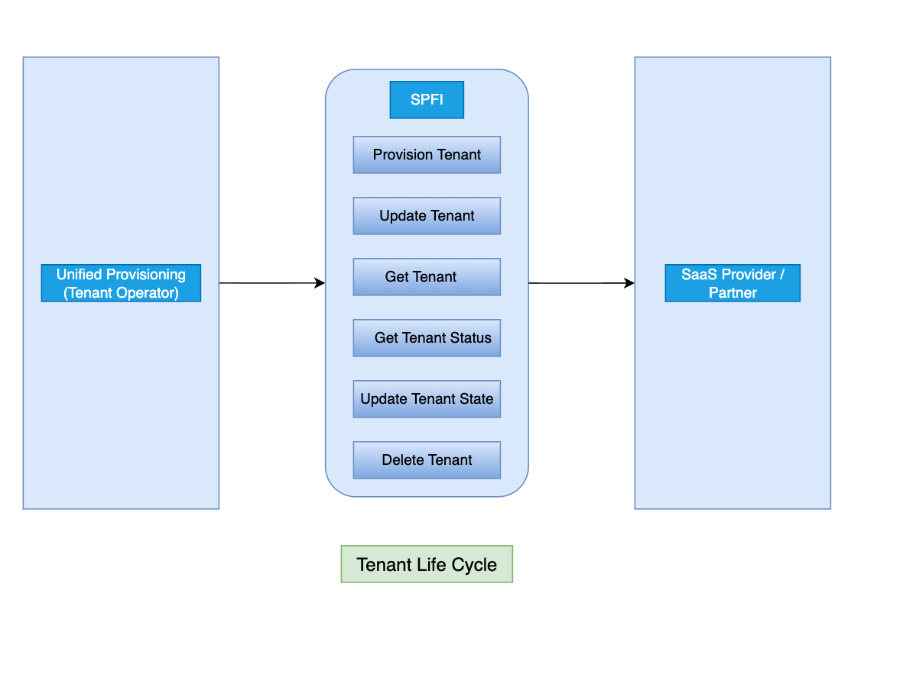

# SAP-samples
Sample app reference for SPFI

Standardized API to trigger the SaaS technical fulfillment request towards SaaS Providers (SAP and Partners). Fulfillment is a high-level term compassing various activities like tenant provisioning, etc.

