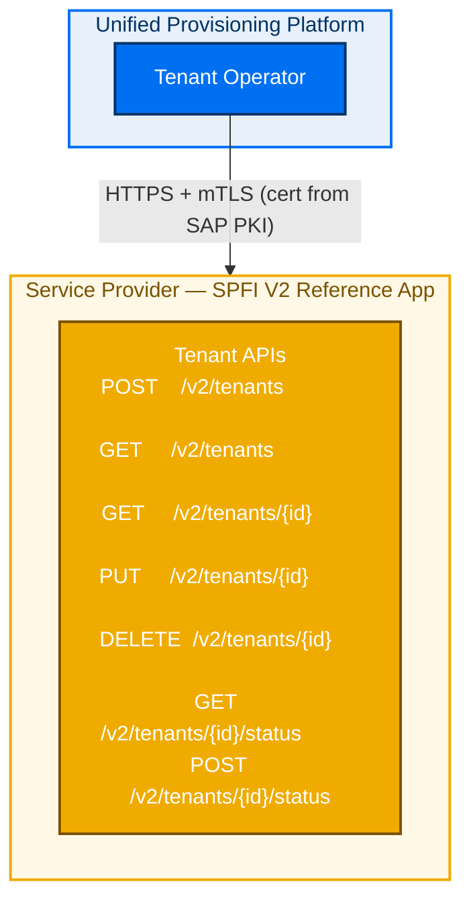
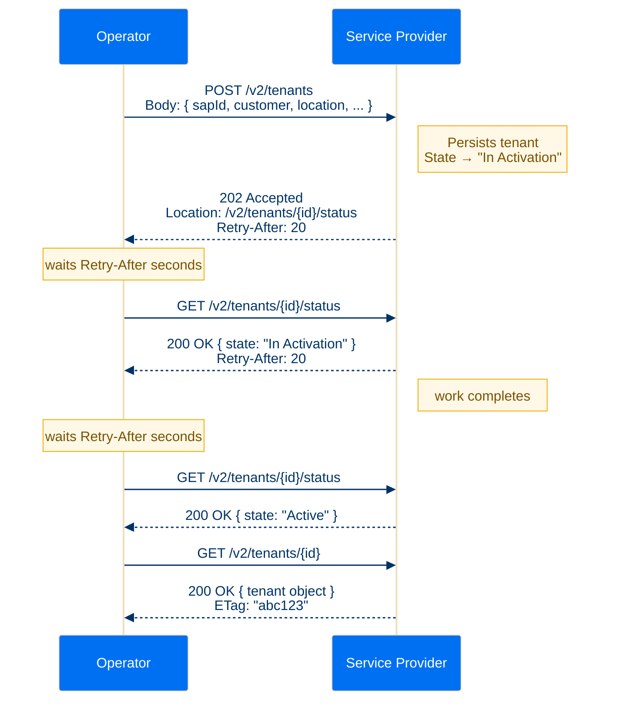
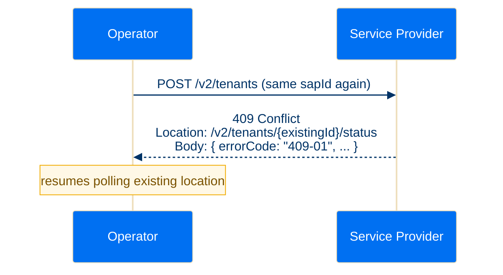
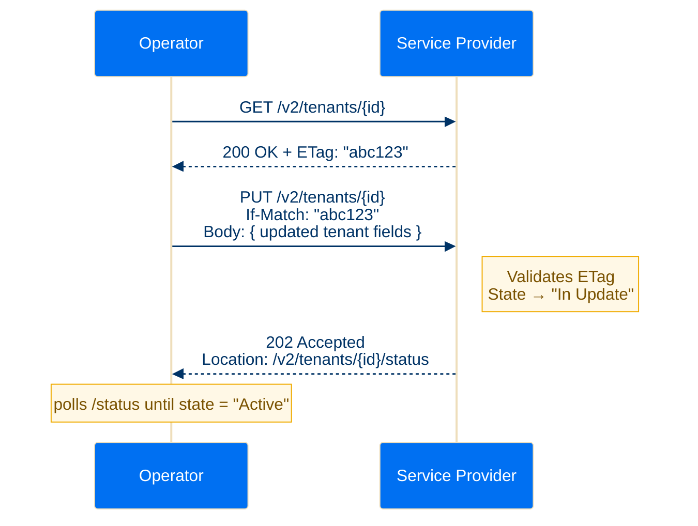
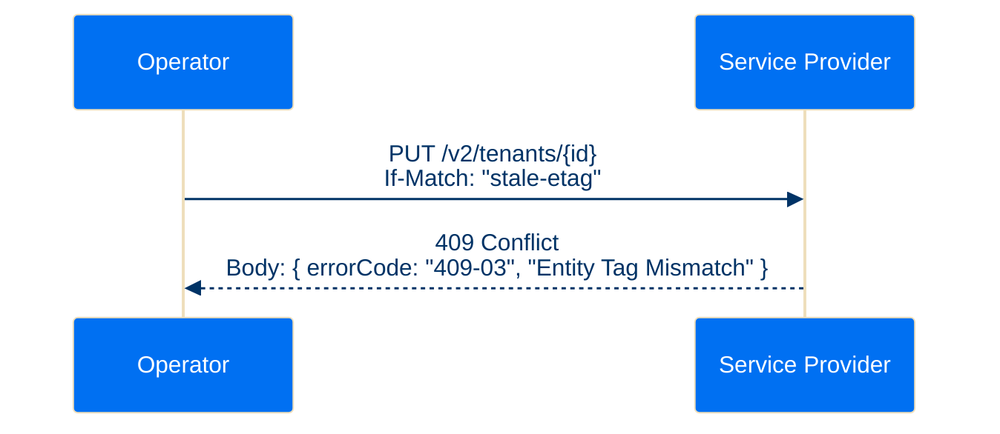
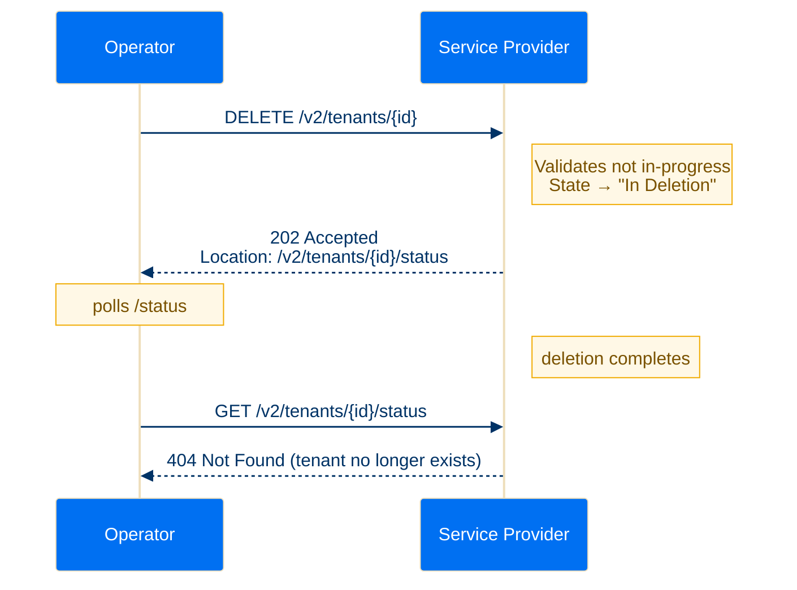
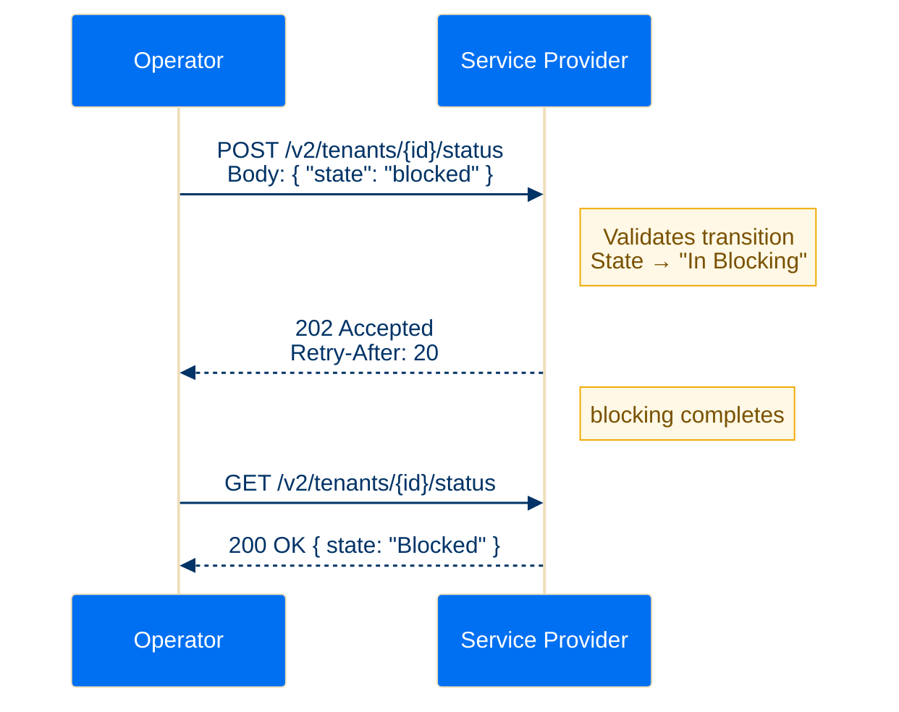
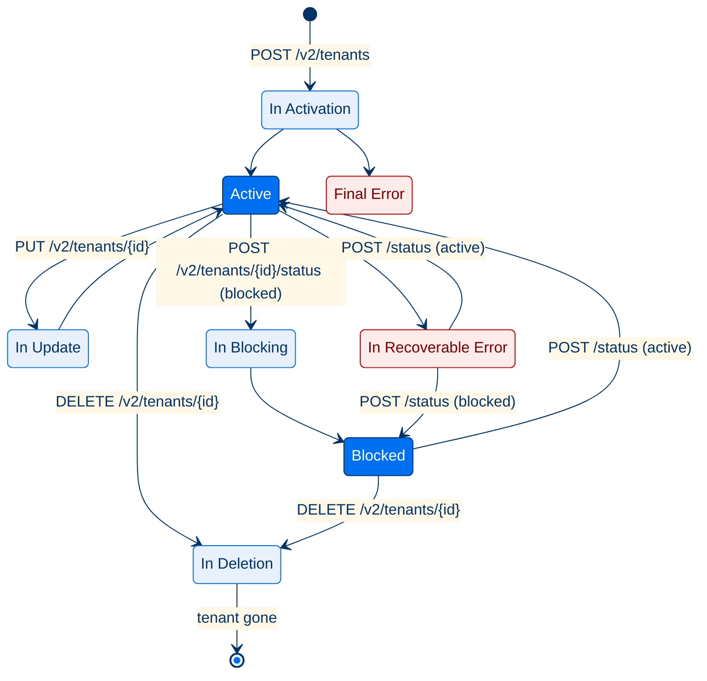

# SPFI V2 Reference Application

A Spring Boot reference application that demonstrates how to implement the **SPFI V2 REST API contract** — the standard interface between a Unified Provisioning operator and a service provider for tenant lifecycle management and SSO configuration.

---

## Table of Contents

1. [What is the SPFI V2 Contract?](#what-is-the-spfi-v2-contract)
2. [Architecture Overview](#architecture-overview)
3. [API Endpoints](#api-endpoints)
4. [Data Model](#data-model)
5. [Tenant Lifecycle Flows](#tenant-lifecycle-flows)
    - [Provisioning (Slow Path)](#provisioning-slow-path)
    - [Update Flow](#update-flow)
    - [Deletion Flow](#deletion-flow)
    - [Lifecycle State Change (Block / Unblock)](#lifecycle-state-change-block--unblock)
6. [Tenant State Machine](#tenant-state-machine)
7. [Security: mTLS](#security-mtls)
    - [Spring Security Configuration](#spring-security-configuration)
8. [Running the Application](#running-the-application)
9. [Testing with curl](#testing-with-curl)
10. [Recommendations](#recommendations)
11. [Troubleshooting](#troubleshooting)
12. [References](#references)

---

## What is the SPFI V2 Contract?

**SPFI** stands for *Service Provider Fulfillment Interface*. Version 2 defines the REST API that any service provider must expose so that the Unified Provisioning platform (the *operator*) can manage the full lifecycle of a tenant on that provider's system.

Key characteristics of the contract:

- **Transport security**: All calls are protected by mutual TLS (mTLS). The operator presents a client certificate; the provider's server validates it.
- **Asynchronous by design**: Long-running operations (provisioning, update, deletion, SSO activation) return `202 Accepted` with a `Location` header pointing to a polling endpoint. Short operations may return `201 Created` or `200 OK` immediately.
- **Polling via `Retry-After`**: Every `202` response carries a `Retry-After` header telling the operator how many seconds to wait before polling the status endpoint again.
- **Optimistic concurrency for updates**: The `GET /tenants/{id}` response includes an `ETag` header. `PUT /tenants/{id}` requires the caller to pass that ETag in an `If-Match` header. A mismatch returns `409 Conflict`.
- **Idempotent activation**: A second `POST /v2/tenants` for the same `sapId` returns `409 Conflict` with the existing tenant's status URL, so the operator can resume polling instead of creating a duplicate.

---

## Architecture Overview


```mermaid
graph TB
    subgraph UPP["Unified Provisioning Platform"]
        OP["Tenant Operator"]
    end

    subgraph SPA["Service Provider — SPFI V2 Reference App"]
        TAPI["Tenant APIs\nPOST    /v2/tenants                      \nGET     /v2/tenants                      \nGET     /v2/tenants/{id}                 \nPUT     /v2/tenants/{id}                 \nDELETE  /v2/tenants/{id}                 \nGET     /v2/tenants/{id}/status          \nPOST    /v2/tenants/{id}/status          "]
    end

    OP -->|"HTTPS + mTLS (cert from SAP PKI)"| SPA

    style UPP fill:#E8F1FB,stroke:#0070F2,stroke-width:2px,color:#003366
    style SPA fill:#FFF8E6,stroke:#F0AB00,stroke-width:2px,color:#7A5200
    style OP fill:#0070F2,stroke:#003366,stroke-width:2px,color:#ffffff
    style TAPI fill:#F0AB00,stroke:#7A5200,stroke-width:2px,color:#ffffff
```

---

## API Endpoints

### Tenant Lifecycle Endpoints

| Method   | Path                            | Description                                   |
|----------|---------------------------------|-----------------------------------------------|
| `POST`   | `/v2/tenants`                   | Activate (provision) a new tenant             |
| `GET`    | `/v2/tenants`                   | List all tenants                              |
| `GET`    | `/v2/tenants/{tenantId}`        | Get a specific tenant (returns ETag header)   |
| `PUT`    | `/v2/tenants/{tenantId}`        | Update a tenant (requires If-Match header)    |
| `DELETE` | `/v2/tenants/{tenantId}`        | Delete (deprovision) a tenant                 |
| `GET`    | `/v2/tenants/{tenantId}/status` | Poll the current status of an operation       |
| `POST`   | `/v2/tenants/{tenantId}/status` | Trigger a lifecycle state change (block/unblock) |

---

## Data Model

### Tenant Object

```json
{
  "id": "<uuid>",
  "sapId": "<CRM tenant ID>",
  "globalTenantId": "<global tenant ID>",
  "businessType": "production",
  "operationType": "standard",
  "customer": {
    "id": "<customer ID>",
    "name": "<customer name>",
    "erpId": "<ERP ID>",
    "contact": {
      "id": "<contact ID>",
      "name": "<contact name>",
      "email": "<email>",
      "phone": "<phone>"
    }
  },
  "location": {
    "geography": {
      "region": "<region>",
      "continent": "<continent>",
      "country": "<country>",
      "city": "<city>"
    },
    "infrastructure": {
      "platform": "<platform>",
      "region": "<region>",
      "zone": "<zone>",
      "dataCenter": "<data center>",
      "landscape": "<landscape>",
      "environment": "<environment>",
      "host": "<host>",
      "internalIdentifier": "<internal ID>"
    }
  },
  "contract": {
    "start": "<ISO date>",
    "end": "<ISO date>"
  },
  "products": [
    { "productId": "<SKU ID>", "quota": 100, "unit": "users" }
  ],
  "initialUsers": [
    { "id": "<user ID>", "email": "<email>", "firstName": "<first>", "lastName": "<last>" }
  ],
  "endpoints": {
    "applicationUrl": "https://app.example.com",
    "configurationUrl": "https://app.example.com/config"
  },
  "additionalProperties": {
    "fromManager": { "key": "value" },
    "fromProvider": { "key": "value" }
  },
  "hostTenantSpecification": {
    "group": "<api group>",
    "version": "<version>",
    "type": "<type>",
    "spec": "<JSON string>"
  },
  "mixinSpecifications": [],
  "status": {
    "state": "Active",
    "lastModified": "<ISO timestamp>",
    "details": {}
  }
}
```

> **Required fields on POST**: `sapId`, `customer` (with `name`, `email`), `location`, at least one `initialUser`.

### Status Object

```json
{
  "state": "In Activation",
  "lastModified": "2024-01-15T10:30:00Z",
  "details": {
    "message": "Tenant provisioning is in progress"
  }
}
```

### State Change Request (POST `/status`)

```json
{ "state": "active" }
```

or

```json
{ "state": "blocked" }
```

---

## Tenant Lifecycle Flows

### Provisioning (Slow Path)

The typical path for provisioning a new tenant. The provider starts the work asynchronously and the operator polls for completion.


```mermaid
%%{init: {'theme': 'base', 'themeVariables': {'actorBkg': '#0070F2', 'actorTextColor': '#ffffff', 'actorBorderColor': '#003366', 'noteBkgColor': '#FFF8E6', 'noteBorderColor': '#F0AB00', 'noteTextColor': '#7A5200', 'activationBkgColor': '#E8F1FB', 'activationBorderColor': '#0070F2', 'sequenceNumberColor': '#ffffff', 'signalColor': '#003366', 'signalTextColor': '#003366', 'labelBoxBkgColor': '#E8F1FB', 'labelTextColor': '#003366'}}}%%
sequenceDiagram
    participant OP as Operator
    participant SP as Service Provider

    OP->>SP: POST /v2/tenants<br/>Body: { sapId, customer, location, ... }
    note right of SP: Persists tenant<br/>State → "In Activation"
    SP-->>OP: 202 Accepted<br/>Location: /v2/tenants/{id}/status<br/>Retry-After: 20

    note over OP: waits Retry-After seconds

    OP->>SP: GET /v2/tenants/{id}/status
    SP-->>OP: 200 OK { state: "In Activation" }<br/>Retry-After: 20

    note right of SP: work completes
    note over OP: waits Retry-After seconds

    OP->>SP: GET /v2/tenants/{id}/status
    SP-->>OP: 200 OK { state: "Active" }

    OP->>SP: GET /v2/tenants/{id}
    SP-->>OP: 200 OK { tenant object }<br/>ETag: "abc123"
```

**Duplicate activation (idempotency):**


```mermaid
%%{init: {'theme': 'base', 'themeVariables': {'actorBkg': '#0070F2', 'actorTextColor': '#ffffff', 'actorBorderColor': '#003366', 'noteBkgColor': '#FFF8E6', 'noteBorderColor': '#F0AB00', 'noteTextColor': '#7A5200', 'activationBkgColor': '#E8F1FB', 'activationBorderColor': '#0070F2', 'signalColor': '#003366', 'signalTextColor': '#003366', 'labelBoxBkgColor': '#E8F1FB', 'labelTextColor': '#003366'}}}%%
sequenceDiagram
    participant OP as Operator
    participant SP as Service Provider

    OP->>SP: POST /v2/tenants (same sapId again)
    SP-->>OP: 409 Conflict<br/>Location: /v2/tenants/{existingId}/status<br/>Body: { errorCode: "409-01", ... }
    note over OP: resumes polling existing location
```

### Update Flow

Tenant updates use optimistic concurrency. The operator must supply the ETag from the most recent GET.


```mermaid
%%{init: {'theme': 'base', 'themeVariables': {'actorBkg': '#0070F2', 'actorTextColor': '#ffffff', 'actorBorderColor': '#003366', 'noteBkgColor': '#FFF8E6', 'noteBorderColor': '#F0AB00', 'noteTextColor': '#7A5200', 'activationBkgColor': '#E8F1FB', 'activationBorderColor': '#0070F2', 'signalColor': '#003366', 'signalTextColor': '#003366', 'labelBoxBkgColor': '#E8F1FB', 'labelTextColor': '#003366'}}}%%
sequenceDiagram
    participant OP as Operator
    participant SP as Service Provider

    OP->>SP: GET /v2/tenants/{id}
    SP-->>OP: 200 OK + ETag: "abc123"

    OP->>SP: PUT /v2/tenants/{id}<br/>If-Match: "abc123"<br/>Body: { updated tenant fields }
    note right of SP: Validates ETag<br/>State → "In Update"
    SP-->>OP: 202 Accepted<br/>Location: /v2/tenants/{id}/status

    note over OP: polls /status until state = "Active"
```

**ETag mismatch (concurrent modification):**


```mermaid
%%{init: {'theme': 'base', 'themeVariables': {'actorBkg': '#0070F2', 'actorTextColor': '#ffffff', 'actorBorderColor': '#003366', 'noteBkgColor': '#FFF8E6', 'noteBorderColor': '#F0AB00', 'noteTextColor': '#7A5200', 'activationBkgColor': '#E8F1FB', 'activationBorderColor': '#0070F2', 'signalColor': '#003366', 'signalTextColor': '#003366', 'labelBoxBkgColor': '#E8F1FB', 'labelTextColor': '#003366'}}}%%
sequenceDiagram
    participant OP as Operator
    participant SP as Service Provider

    OP->>SP: PUT /v2/tenants/{id}<br/>If-Match: "stale-etag"
    SP-->>OP: 409 Conflict<br/>Body: { errorCode: "409-03", "Entity Tag Mismatch" }
```

> **Note**: Update is only allowed when the tenant is in `Active` state.

### Deletion Flow


```mermaid
%%{init: {'theme': 'base', 'themeVariables': {'actorBkg': '#0070F2', 'actorTextColor': '#ffffff', 'actorBorderColor': '#003366', 'noteBkgColor': '#FFF8E6', 'noteBorderColor': '#F0AB00', 'noteTextColor': '#7A5200', 'activationBkgColor': '#E8F1FB', 'activationBorderColor': '#0070F2', 'signalColor': '#003366', 'signalTextColor': '#003366', 'labelBoxBkgColor': '#E8F1FB', 'labelTextColor': '#003366'}}}%%
sequenceDiagram
    participant OP as Operator
    participant SP as Service Provider

    OP->>SP: DELETE /v2/tenants/{id}
    note right of SP: Validates not in-progress<br/>State → "In Deletion"
    SP-->>OP: 202 Accepted<br/>Location: /v2/tenants/{id}/status

    note over OP: polls /status
    note right of SP: deletion completes

    OP->>SP: GET /v2/tenants/{id}/status
    SP-->>OP: 404 Not Found (tenant no longer exists)
```

> **Note**: Deletion is rejected if the tenant is currently in any in-progress state (`In Activation`, `In Update`, `In Deletion`, `In Blocking`).

### Lifecycle State Change (Block / Unblock)


```mermaid
%%{init: {'theme': 'base', 'themeVariables': {'actorBkg': '#0070F2', 'actorTextColor': '#ffffff', 'actorBorderColor': '#003366', 'noteBkgColor': '#FFF8E6', 'noteBorderColor': '#F0AB00', 'noteTextColor': '#7A5200', 'activationBkgColor': '#E8F1FB', 'activationBorderColor': '#0070F2', 'signalColor': '#003366', 'signalTextColor': '#003366', 'labelBoxBkgColor': '#E8F1FB', 'labelTextColor': '#003366'}}}%%
sequenceDiagram
    participant OP as Operator
    participant SP as Service Provider

    OP->>SP: POST /v2/tenants/{id}/status<br/>Body: { "state": "blocked" }
    note right of SP: Validates transition<br/>State → "In Blocking"
    SP-->>OP: 202 Accepted<br/>Retry-After: 20

    note right of SP: blocking completes

    OP->>SP: GET /v2/tenants/{id}/status
    SP-->>OP: 200 OK { state: "Blocked" }
```

**Allowed state transitions via POST `/status`:**

| Current State          | Allowed Target States |
|------------------------|-----------------------|
| `Active`               | `blocked`             |
| `Blocked`              | `active`              |
| `In Recoverable Error` | `active`, `blocked`   |
| Any in-progress state  | *(not allowed)*       |


---

## Tenant State Machine


```mermaid
%%{init: {'theme': 'base', 'themeVariables': {'primaryColor': '#E8F1FB', 'primaryBorderColor': '#0070F2', 'primaryTextColor': '#003366', 'secondaryColor': '#FFF8E6', 'secondaryBorderColor': '#F0AB00', 'secondaryTextColor': '#7A5200', 'tertiaryColor': '#fdecea', 'tertiaryBorderColor': '#cc0000', 'tertiaryTextColor': '#7a0000', 'lineColor': '#003366', 'textColor': '#003366'}}}%%
stateDiagram-v2
    [*] --> InActivation : POST /v2/tenants

    InActivation --> Active
    InActivation --> FinalError

    Active --> InUpdate : PUT /v2/tenants/{id}
    Active --> InBlocking : POST /v2/tenants/{id}/status (blocked)
    Active --> InRecoverableError

    InUpdate --> Active
    InBlocking --> Blocked
    InRecoverableError --> Blocked : POST /status (blocked)
    InRecoverableError --> Active : POST /status (active)

    Active --> InDeletion : DELETE /v2/tenants/{id}
    Blocked --> InDeletion : DELETE /v2/tenants/{id}
    Blocked --> Active : POST /status (active)
    InDeletion --> [*] : tenant gone

    state "In Activation" as InActivation
    state "Active" as Active
    state "Final Error" as FinalError
    state "In Update" as InUpdate
    state "In Blocking" as InBlocking
    state "In Recoverable Error" as InRecoverableError
    state "Blocked" as Blocked
    state "In Deletion" as InDeletion

    classDef inProgress fill:#E8F1FB,stroke:#0070F2,color:#003366
    classDef stable fill:#0070F2,stroke:#003366,color:#ffffff
    classDef error fill:#fdecea,stroke:#cc0000,color:#7a0000
    classDef blocked fill:#FFF8E6,stroke:#F0AB00,color:#7A5200

    class InActivation,InUpdate,InBlocking,InDeletion inProgress
    class Active,Blocked stable
    class FinalError,InRecoverableError error
```

> **In-progress states** (`In Activation`, `In Update`, `In Deletion`, `In Blocking`) — deletion and update are rejected while in any of these.

---

## Security: mTLS

All API calls are protected with mutual TLS. The operator presents a client certificate issued by the SAP PKI service; the application server validates this certificate against a configured truststore.


```

### Spring Security Configuration

```java
@Configuration
@EnableWebSecurity
public class SecurityConfig {

    @Bean
    public SecurityFilterChain filterChain(HttpSecurity http) throws Exception {
        http
            .authorizeHttpRequests(authorize -> authorize
                .requestMatchers("/health/**").permitAll()
                .anyRequest().authenticated()
            )
            .x509(x509 -> x509
                .subjectPrincipalRegex("CN=(.*?)(?:,|$)")
                .userDetailsService(userDetailsService())
            );
        return http.build();
    }

    @Bean
    public UserDetailsService userDetailsService() {
        return username -> new User(username, "",
            AuthorityUtils.commaSeparatedStringToAuthorityList("ROLE_USER"));
    }
}
```

## Running the Application

**Local (development profile):**

```shell
mvn spring-boot:run -Dspring-boot.run.profiles=local
```

**Cloud Foundry:**

The `manifest.yaml` configures the CF deployment:

```yaml
env:
  SPRING_PROFILES_ACTIVE: "cf"
  HEADER_RETRY_AFTER_SECONDS: "20"
```

The `HEADER_RETRY_AFTER_SECONDS` variable controls the value returned in `Retry-After` headers (default: `120` seconds if not set).

---

## Testing with curl

```shell
# List tenants
curl https://<host>/v2/tenants \
  --cert certs/client-certificate_chain.pem \
  --key certs/private-key.pem \
  --cacert certs/ca.crt

# Activate a tenant
curl -X POST https://<host>/v2/tenants \
  -H "Content-Type: application/json" \
  --cert certs/client-certificate_chain.pem \
  --key certs/private-key.pem \
  --cacert certs/ca.crt \
  -d '{
    "sapId": "T-12345",
    "customer": {
      "id": "C-001",
      "name": "Acme Corp",
      "contact": { "name": "Jane", "email": "jane@acme.com", "phone": "+1234" }
    },
    "businessType": "production",
    "location": {
      "geography": { "region": "eu", "country": "DE" },
      "infrastructure": { "dataCenter": "eu10" }
    },
    "initialUsers": [{ "id": "U-001", "email": "admin@acme.com" }],
    "sso": [{
      "identityProvider": {
        "authProtocol": "SAML2",
        "metadataURL": "https://idp.acme.com/metadata"
      }
    }]
  }'

# Poll status
curl https://<host>/v2/tenants/{tenantId}/status \
  --cert certs/client-certificate_chain.pem \
  --key certs/private-key.pem \
  --cacert certs/ca.crt
```

---

## Recommendations

### API Implementation

- **Always return `Retry-After` on `202` responses.** The operator uses this value to schedule its next poll. A missing or very short value can cause tight polling loops that overload the provider.
- **Implement ETag correctly.** Generate the ETag from a hash of the tenant's mutable fields or a version counter. Never return a static or empty ETag — it breaks concurrent update detection.
- **Implement idempotency for `POST /v2/tenants`.** Check for an existing tenant with the same `sapId` before creating a new one. Return `409` with the existing tenant's status URL rather than creating a duplicate.
- **Validate state transitions strictly.** Reject `DELETE` and `PUT` requests when the tenant is in an in-progress state (`In Activation`, `In Update`, `In Deletion`, `In Blocking`). Returning a clear error message helps the operator handle retries correctly.
- **Propagate meaningful status details.** The `status.details` field is surfaced to platform users when provisioning fails. Include actionable information rather than internal stack traces.
- **Use `Final Error` state only for non-recoverable failures.** The operator stops retrying on `Final Error`. Use `In Recoverable Error` or `In Self-Recoverable Error` for transient issues.
- **Generate tenant IDs as GUIDs (UUID v4).** The `id` assigned to a tenant on creation should be a randomly generated UUID (e.g. `550e8400-e29b-41d4-a716-446655440000`). This ensures global uniqueness across tenants and systems, avoids predictable or sequential IDs that could be guessed, and aligns with the format expected by the operator when storing and referencing the tenant.

### Security (High)

- **Verify the certificate chain is complete** (intermediate CAs included).
- **Check certificate expiration**: `openssl x509 -in cert.pem -noout -dates`
- **Ensure the server's hostname matches the CN or SAN** in the server certificate.
- **Validate the CN** against the response of the `/certInfo` endpoint from the Operator.

### Operations

- **Configure `HEADER_RETRY_AFTER_SECONDS` based on your actual provisioning time.** Setting it too low increases polling load; too high delays the operator from detecting completion. A value of 20–60 seconds is typical for most operations.
- **Implement health endpoints** (`/health/liveness`, `/health/readiness`) and permit them without mTLS so that the platform's load balancer can route traffic correctly.
- **Design the status endpoint to be stateless and fast.** It will be called frequently during provisioning. Avoid database writes or heavy computation in `GET /status` handlers.
- **Persist tenant state durably.** The reference application uses a file-based store for demonstration. Production implementations should use a reliable database so that state survives restarts.
- **Test the full async flow end-to-end.** Unit tests verify logic, but integration tests that exercise the complete slow-path provisioning loop (including polling) catch timing and state-machine bugs that unit tests miss.

---

## Troubleshooting

### Connection Refused

- Verify the server is running on the expected port (default: `8443` for HTTPS).
- Check that `server.ssl.enabled=true` is set in the active profile.
- Confirm firewall or security group rules allow inbound HTTPS traffic.

### 409 Conflict on Activation

- A tenant with the same `sapId` already exists. Follow the `Location` header in the response to resume polling the existing tenant's status URL.

### 409 Conflict on Update (ETag Mismatch)

- Re-fetch the tenant with `GET /v2/tenants/{id}` to obtain a fresh ETag, then retry the `PUT`.

### 403 / 401 on Every Request

- Verify the client certificate is signed by a CA that is in the server's truststore.
- Check that `server.ssl.client-auth=need` is configured.
- Confirm the certificate validation filter is not rejecting the CN of the operator's certificate.

---

## References
- [Swagger Documentation](SPFI%20V2%20Reference%20Application%20Swagger.pdf)
- [Securing Spring Boot Applications with SSL](https://spring.io/blog/2023/06/07/securing-spring-boot-applications-with-ssl)
